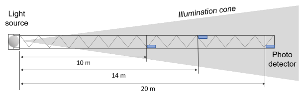
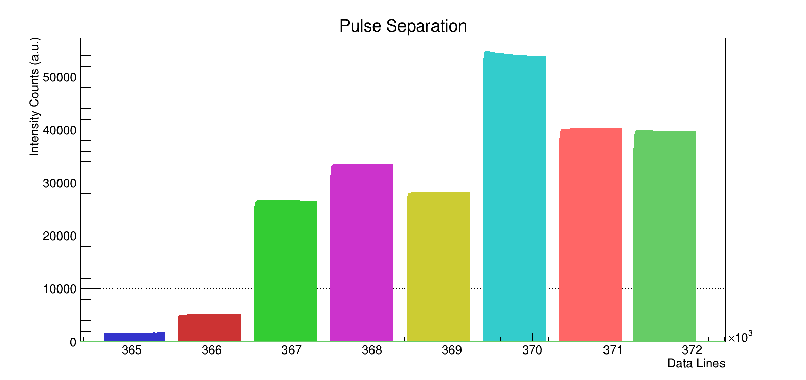

# LAMS_2.0

LAMS 2.0 is the revived version of the LAMS project from 2008 $\rightarrow$ 2010.

## Introduction
LAMS : _"Long Arm Marine Spectrophotometer"_

The LAMS is an instrument that measures the light transmission length in deep sea for eight different wavelengths from the near UV to green visible region, where the transmission length is maximum. The operation principle is based on measuring the light intensity from a point source (LED sources of different wavelengths ranging from 375nm to 520nm) at a set of fixed length optical paths.



The original LAMS device was constructed for measuring the transmission length 
$L_\beta$. By comparing the measurements one can eliminate the geometrical factor $\dfrac{1}{R^2}$ and thus determine the transmission coefficient. The original LAMS was used to measure the transmission length in the deep sea during the sea campaigns of 2008 and 2009.

## Physics

Point or spherical sources of light (or sources that do not favor a specific direction) radiate in sphere fronts, following the Inverse Square law. The measured intensity in a medium, at a specific distance away from the source, will be the combination of Beer-Lambert and Inverse Square laws:

$$ I = \dfrac{S}{4 \pi R^2} \cdot e^{-\beta R} $$


The transmission coefficient $\beta$ depends on the light's wavelength and the physical properties of the medium, as an extension of the dependence of absorption and scattering to these parameters. The transmission coefficient $\beta$ can also be referred to as transmission length, defined by the mathematical expression:

$$ R_\beta = \dfrac{1}{\beta} $$

## Codebase

For the original LAMS, during the process of submersion of the frame, depth and time were recorded in a log-book. The data were exported as .txt files and contained the intensities of the photo-diodes (PDs) and a counter, each entry in a line. Therefore, the cycles and pulses of the data would be determined by hard coding the times in the program, along with their respective depths.

For the LAMS 2.0, the .txt files contain different information and a new method was developed to automatically determine the cycles and pulses in the data. Firstly, the electronic boards export the intensities for the pairs of PDs, pressure and temperature, all contained in one line per sample, in hexadecimal.

### Data Preparation

The LAMS 2.0 pipeline dictates that the `.txt` files are initially converted to custom binary files, using the [`Convert.C`](Convert.C) source script and [`TextToBinary.hh`](TextToBinary.hh) header. Reasons for doing this are written as comment in the header.


### Data Entry

The next step is to extract the information from the data and contain them iteratively in a `Slice` (inspired by the _TimeSlices_ of KM3NeT). The functions that achieve this can be found in the headers [`Slices.hh`](Slices.hh) and [`DataGrabber.hh`](DataGrabber.hh). Here's an example:

```cpp
std::vector <Slice> data;
DataGrabber readData;
std::string file;

readData.Open(file);      // Opens binary file
readData.Prepare(data);   // Prepares the std::vector for reading
readData.Fill(data);      // Fills the std::vector
```

### Pattern Recognition

The final step is to insert the `data` container in the [`Pattern Recognition`](Pattern.hh) algorithm, to achieve separation and classification of pulses. The process is automatic and split into different `stages`. If the pulses are not detected properly, there might be a need to manually tweak these variables: **darkCurrent**, **saturationLight**, **ph_disagreement_tolerance** or in the worst case (do last) the hardcoded **stability** constant `400`.

Here's example code of how to use this:

```cpp
PatternRecognition Pattern;

vector <unsigned short> wave;
for (unsigned i = 0; i < 8; i++){
    wave.push_back(i);   // wave = [0, 1, 2, 3, 4, 5, 6, 7]
}

Pattern.Stage_1(data);
Pattern.Stage_2(data); 
Pattern.Stage_3_1(data, wave);
```




All source scripts other than [`Convert.C`](Convert.C) are standalone programs and exist in the end of the pipeline, to produce results and plots.

## Compilation and Data

This project was built for running in the Lyon-CC environment. Use the following command to compile:
```bash
python3 make.py
```

The data were too large to upload on GitHub. They should be saved on _Z_ server in NCSR Demokritos.

Data and Results should also be found in Lyon:
```
/sps/km3net/users/zarpapis/vault/LAMS_2/
```

## References & Closing Remarks

Have a look at my Master's Thesis for motivations and explanations on creating this codebase. I've also included important papers and books, relevant to the project.

Feel free to contact me if you have any questions!

~ Georgios Zarpapis

zarpapis@inp.demokritos.gr

gzarpapis@hotmail.com